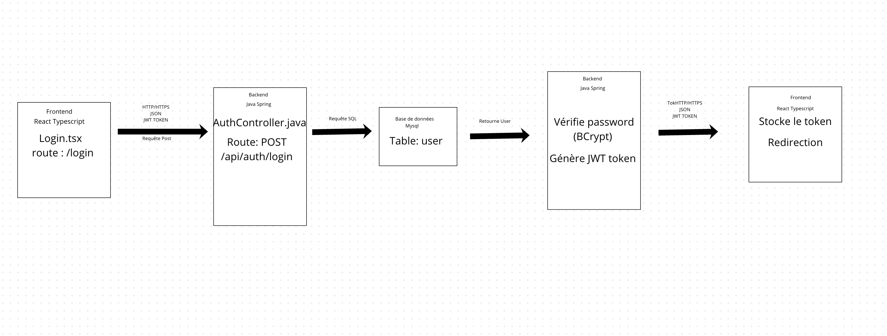

# Architecture du projet RecrutPlus

## Choix architectural : 3-Tiers (Frontend – Backend – Base de données)

Le projet **RecrutPlus** adopte une architecture en **trois couches distinctes** :

1. **Frontend (Présentation)**  
   - Implémenté avec **React + Vite + TypeScript**.  
   - Gère l’interface utilisateur et l’expérience visuelle.  
   - Communique avec le backend via des appels HTTP (API REST).

2. **Backend (Logique métier / API)**  
   - Implémenté avec **Java + Spring Boot + Maven**.  
   - Contient les règles métier, la logique de traitement et la gestion des flux.  
   - Expose des **endpoints REST** consommés par le frontend.  
   - Sert d’intermédiaire entre la présentation et la base de données.

3. **Base de données (Persistance)**  
   - Utilise **MySQL** comme système de gestion de base de données relationnelle.  
   - Gérée via **Spring Data JPA / Hibernate**.  
   - Stocke les utilisateurs, offres d’emploi, candidatures, etc.  
   - Fournit des entités et des repositories pour manipuler les données.

### Avantages

- **Séparation claire des responsabilités** → chaque couche a un rôle précis.  
- **Maintenabilité** → modifications isolées sans impacter tout le système.  
- **Scalabilité** → possibilité de déployer chaque couche indépendamment.  
- **Sécurité** → le backend contrôle l’accès aux données, le frontend n’y accède jamais directement.  
- **Standard industriel** → MySQL est largement utilisé, fiable et bien supporté.  
- **Réutilisabilité** → le backend peut servir plusieurs clients (web, mobile, etc.).

### Inconvénients

- **Complexité accrue** → nécessite de gérer plusieurs environnements (frontend, backend, base).  
- **Performance** → chaque requête traverse plusieurs couches, ce qui peut ajouter de la latence.  
- **Déploiement** → demande une bonne orchestration (CI/CD, conteneurs, etc.).  
- **Synchronisation** → frontend et backend doivent rester alignés sur les contrats API.  
- **Gestion de la base** → MySQL nécessite une configuration et une maintenance (sauvegardes, migrations, optimisation des requêtes).

### Conclusion

Cette architecture **3-Tiers avec MySQL** est adaptée à RecrutPlus car elle :
- Sépare clairement la présentation, la logique métier et la persistance.  
- Permet une évolution future.
- Offre une structure robuste et professionnelle, proche des standards industriels.  

Malgré une complexité plus élevée qu’une architecture monolithique simple, elle garantit une meilleure maintenabilité et une évolutivité à lo

# Justification des choix technologiques

## Frontend : React + Vite + TypeScript
React permet de créer des interfaces dynamiques et modulaires, faciles à maintenir.  
Vite apporte une rapidité de développement et TypeScript sécurise le code avec un typage fort.  

## Backend : Java + Spring Boot + Maven
Java et Spring Boot offrent une base robuste et éprouvée pour développer des API REST sécurisées.  
Spring simplifie la configuration et s’intègre facilement avec JPA/Hibernate pour gérer la logique métier.  

## Base de données : MySQL
MySQL est un SGBD relationnel fiable, largement utilisé et bien supporté.  
Il s’intègre parfaitement avec Spring Data JPA pour gérer les entités et assurer la persistance des données.

# Architecture globale

Voici une vue d’ensemble de l’architecture 3-Tiers (Frontend – Backend – Base de données) :

## Interactions entre les différents blocs

Exemple : processus de **login** ,gestion des **candidatures** et création des **offres**.

Exemple : processus de **login** 

Exemple : processus de création des **offres**

Exemple : processus de gestion des **candidatures**

## Diagrammes de séquence

Diagrammes de séquence pour les cas d’usage **CréerOffre** :

Diagrammes de séquence pour les cas d’usage **gérerCandidature** :

